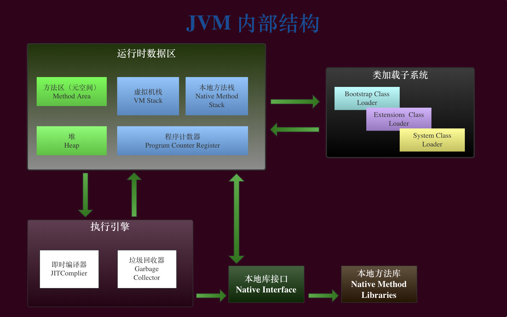
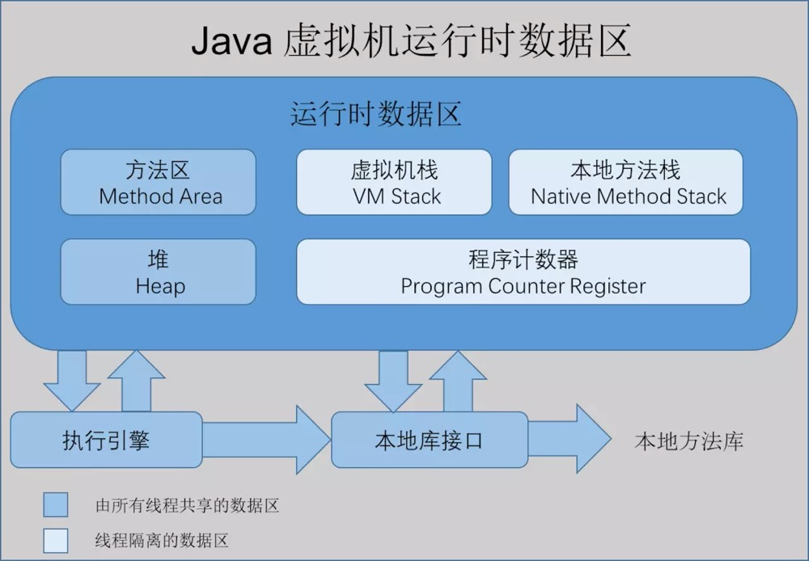
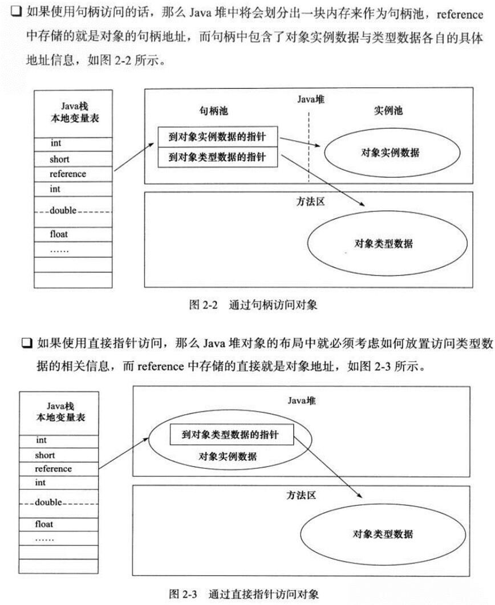

# Java 虚拟机

-----

> 内部结构成员：
> 
> 运行时数据区、类加载器、执行引擎、本地库接口、本地方法库，关系如下：

## 运行时数据区

#### 程序计数器

> 内存空间小，线程私有；
> 
> *字节码解释器* 工作是就是通过改变这个 *计数器的值* 来选取下一条需要执行指令的字节码指令，包括分支、循环、跳转、异常处理、线程恢复等基础功能；
> 
> 如果线程正在执行一个 `Java 方法`，这个计数器记录的是 **正在执行的虚拟机字节码指令的地址**；如果正在执行的是 `Native 方法`，这个计数器的值则为 ***(Undefined)***；
> 
> 此内存区域是唯一一个在 Java 虚拟机规范中没有规定任何 `OutOfMemoryError` 情况的区域。

#### Java 虚拟机栈

> 线程私有，生命周期和线程一致；
> 
> 描述的是 Java 方法执行的内存模型：每个方法在执行时都会床创建一个 ***栈帧(Stack Frame)*** 用于存储局部 ***变量表、操作数栈、动态链接、方法出口*** 等信息，每一个方法从调用直至执行结束，就对应着一个栈帧从虚拟机栈中入栈到出栈的过程。

- 常见异常

> `StackOverflowError`：线程请求的栈深度大于虚拟机所允许的深度； 
> `OutOfMemoryError`：如果虚拟机栈可以动态扩展，而扩展时无法申请到足够的内存。

- 栈桢

#### 本地方法栈

> 区别于 Java 虚拟机栈的是，Java 虚拟机栈为虚拟机执行 Java 方法(也就是字节码)服务，而本地方法栈则为虚拟机使用到的 Native 方法服务；
> 
> 也会有 StackOverflowError 和 OutOfMemoryError 异常。

#### Java 堆

> 对于绝大多数应用来说，这块区域是 JVM 所管理的内存中最大的一块；
> 
> 线程共享，主要是存放 ***对象实例*** 和 ***数组***；
> 
> 内部会划分出多个线程私有的分配缓冲区(Thread Local Allocation Buffer, TLAB)，可以位于物理上不连续的空间，但是逻辑上要连续。

- 常见异常

> `OutOfMemoryError`：如果堆中没有内存完成实例分配，并且堆也无法再扩展时，抛出该异常。

#### 方法区

> 属于共享内存区域，存储 ***已被虚拟机加载的类元数据信息、常量（final 修饰的成员变量）、静态变量、方法元数据、即时编译器编译后的代码*** 等数据；
> 
> JDK 1.8 以前，还区域也叫数据区，位于堆内内存的永久代；JDK 1.8 及以后，这个概念被 ***元空间*** 取代，位于堆外内存。
>> 方法区和堆内存的永久代其实一个东西，一个是理论，一个是具体的实现，为什么要分开说呢，因为 ***方法区包含永久代***，但是反过来就不能这么说， 所以这也正如作者所说，一个是接口，一个是具体实现。

## Java 类加载过程

> 将类的 `.class` 文件中的二进制数据读入到运行时数据区的方法区内，然后在堆区创建一个  `java.lang.Class` 对象，用来封装类在方法区内的数据结构。过程如下：

> ***编译***：`.java` 文件编译后生成 `.class` 字节码文件；  
> ***加载（Loading）***：*类加载器* 负责根据一个类的 *全限定名* 来读取此类的二进制字节流到 JVM，并存储在方法区（元空间），然后将其转换为一个与目标类型对应的 `java.lang.Class` 对象实例；  
> ***连接（Linking）***：细分三步
>> ***验证（Verification）***：*格式*（class文件规范） *语义*（final类是否有子类） 操作；  
>> ***准备（Preparation）***：
>>> 1. 静态变量 *赋初值* 和 *分配内存空间*；
>>> 2. final 修饰的内存空间 *直接赋原值(不是用户指定的初值)* 。
>>
>> ***解析（Resolution）***：符号引用转化为直接引用，分配地址（主要针对类或接口、字段、类方法、接口方法、方法类型、方法句柄和调用点限定符7类符号引用）；
>
> ***初始化（Initialization）***：
>> 1. 有父类先初始化父类，然后初始化自己；
>> 2. 执行代码块和静态代码块，如果有静态变量，则用用户指定值覆盖原有初值；
>
> ***使用（Using）***  
> ***卸载（Unloading）***

#### 类加载器

- Bootstrap ClassLoader

> 启动类加载器，***`%JRE_HOME%\lib`***（可根据配置 `-Xbootclasspath` 修改），如：`rt.jar`、`resources.jar`、`charsets.jar`、`class`；

- Extention ClassLoader

> 扩展类加载器，***`%JRE_HOME%\lib\ext`***（可根据配置 `-D java.ext.dirs` 修改）；

- System ClassLoader

> 应用程序类加载器，***`classpath`***。

#### 双亲委派原则

> 当一个类加载器收到类加载任务，会先交给其父类加载器去完成，因此最终加载任务都会传递到顶层的启动类加载器，只有当父类加载器无法完成加载任务时， 它才会尝试执行加载任务。
> 
> **保证**：避免重复加载、保护核心API

## HotSpot 虚拟机对象

#### 对象创建过程

> 简单来说就是 JVM 分配内存的过程，用 `new` 关键字进行对象的创建：
>
> 

| `new` ${Class Name}  | 
|  :---- |
| (1) 在运行时常量池中定位该类的引用 | 
| (1-1) 若没有则进行 类加载过程 |
| (2) 为对象分配内存空间（堆操作）   方式：指针碰撞（内存规整）、空闲列表（内存不规整）  多线程安全：同步处理（CAS+失败重试）、TLAB |
| (3) 对对象的字段进行零值初始化 0 值（对象头除外）|
| (4) 设置对象头标记（见下⬇️） |
| (5) 初始化，调用 `init()` 方法 |

> 堆内存是否规整，取决于 JVM 采用的垃圾回收器是否有 **压缩整理** 功能；
> 

- 对象头

> 在对象中添加一些 ***标记字段*** 用于增强对象功能。

| 标记字段| 描述 |
| ---- | ---- |
| Mark Word | 存储对象自身的运行时数据    如 HashCode、GC 分代年龄、锁状态标识、线程池有的锁、偏向线程ID、偏向时间戳等，32JVM为32位 |
| Class Pointer | 存储对象的类型指针，确定这个对象是哪个类的实例，32位JVM为32位 |
| Array Length | 如果对象是数组，则存储数组长度 |

- 对象引用方式

https://blog.csdn.net/qq_41701956/article/details/81664921

