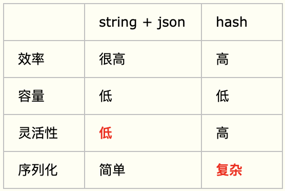

# Redis 小笔记

## 一、基本数据类型

>在redis中,所有数据类型都被封装在一个redisObject结构中,用于提供统一的接口

>Redis有序列表有压缩列表ziplist（内存连续的特殊双向链表）和跳表skiplist两种实现方式，通过encoding识别，当数据项数目小于zset\_max\_ziplist\_entries(默认为128)，且保存的所有元素长度不超过zset\_max\_ziplist\_value(默认为64)时，则用ziplist实现有序集合，否则使用zset结构，zset底层使用skiplist跳表和dict字典。

#### String

>&nbsp;&nbsp;&nbsp;&nbsp;&nbsp;最基本数据类型，一个key对应一个value；可以包含任何数据，比如jpg图片或者序列化的对象；一个键最大能存储512MB

- 常用命令

```python
1.查询：GET key
2.新增：SET key value
3.设置过期：EXPIRE key seconds
4.删除：DEL key
```

- 使用场景
	- 基于token的单点登录
	- 使用 `INCR` 和 `DECR` 实现分布式计数器
	- string + json 的对象存储
	- 分布式锁：基于`setnx`、`expire`、`del`组合实现

#### Hash

>&nbsp;&nbsp;&nbsp;&nbsp;&nbsp;Hash是一个键值对集合，也叫字典或映射表，`特别适合用于存储对象` 。实际是内部存储的Value为一个HashMap，并提供了直接存取这个Map成员的接口。

>&nbsp;&nbsp;&nbsp;&nbsp;&nbsp;实际这里会有2种不同实现: 1.Hash的成员比较少时Redis为了节省内存会采用类似一维数组的方式来紧凑存储，对应的value redisObject的encoding为zipmap；2.当成员数量增大时会自动转成真正的HashMap,此时encoding为ht。

- 常用命令

```python
1.查询属性：HGET key field
2.查询全部属性：HGETALL key
3.新增单个属性：HSET key field value
4.新增多个属性：HMSET key field1 value1 [field2 value2]
5.删除属性：HDEL key field1 [field2]
```

- 使用场景
	- 购物车：以用户id为key，商品id为field，商品数量为value
	- 存储对象(当对象的某个属性需要频繁修改时)：与string类型对象存储的区别
	

#### List

>&nbsp;&nbsp;&nbsp;&nbsp;&nbsp;Redis最重要的数据结构之一，双向链表结构，即可以支持反向查找和遍历，更方便操作，不过带来了部分额外的内存开销。

- 常用命令

```python
1.左阻塞取值（如果列表没有元素会阻塞列表直到等待超时或发现可弹出元素为止，下同）：
BLPOP key1 [key2] timeout
2.右阻塞取值：BRPOP key1 [key2] timeout
3.左/右非阻塞取值（最后一个元素）：LPOP/RPOP key
4.左/右新增值：LPUSH/RPUSH key value1 [value2]
5.获取指定范围内的元素：LRANGE key start stop
```

- 使用场景
	- 消息队列：基于`lpop`和`rpush`（或者反过来，`lpush`和`rpop`）能实现队列的功能。
	- 排行榜（只适合定时计算排行榜）：`lrange`命令可以分页查看队列中的数据，可将每隔一段时间计算一次的排行榜存储在list类型中，如每日的手机销量排行、学校月考学生的成绩排名等。
	- 最新列表：`lpush`和`lrange`能实现最新列表的功能，每次通过lpush命令往列表里插入新的元素，然后通过lrange命令读取最新的元素列表，如朋友圈的点赞列表、评论列表。**对于频繁更新的列表不适合**。

***&nbsp;&nbsp;&nbsp;&nbsp;&nbsp;&nbsp;&nbsp;&nbsp;&nbsp;&nbsp;那么问题来了，对于`排行榜`和`最新列表`两种应用场景，list类型能做到的sorted set类型都能做到，list类型做不到的sorted set类型也能做到，那为什么还要使用list类型去实现排行榜或最新列表呢，直接用sorted set类型不是更好吗？原因是sorted set类型占用的内存容量是list类型的`数倍之多`，对于列表数量不多的情况，可以用sorted set类型来实现***

#### Set

>&nbsp;&nbsp;&nbsp;&nbsp;&nbsp;与List类似，但他支持自动排重，同时也提供了判断某个成员是否在一个set集合内的重要接口。

- 常用命令

```python
sadd,spop,smembers,sunion
1.向key中放入元素：SADD key member1 [member2]
2.移除并返回集合中的一个随机元素：SPOP key
3.返回集合中的所有成员：SMEMBERS key
4.返回所有给定集合的并集：SUNION key1 [key2]
5.返回给定所有集合的差集：SDIFF key1 [key2]
```

- 使用场景
	- 好友/关注/粉丝/感兴趣的人集合
	
	```
	a. sinter命令可以获得A和B两个用户的共同好友
	b. sismember命令可以判断A是否是B的好友
	c. scard命令可以获取好友数量
	d. 关注时，smove命令可以将B从A的粉丝集合转移到A的好友集合
	
	需要注意的是，如果你用的是Redis Cluster集群，对于sinter、smove这种操作多个key的命令，要求这两个key必须存储在同一个slot（槽位）中，否则会报出 (error) CROSSSLOT Keys in request don't hash to the same slot 错误。Redis Cluster一共有16384个slot，每个key都是通过哈希算法CRC16(key)获取数值哈希，再模16384来定位slot的。要使得两个key处于同一slot，除了两个key一模一样，还有没有别的方法呢？答案是肯定的，Redis提供了一种Hash Tag的功能，在key中使用{}括起key中的一部分，在进行 CRC16(key) mod 16384 的过程中，只会对{}内的字符串计算，例如friend_set:{123456}和fans_set:{123456}，分别表示用户123456的好友集合和粉丝集合，在定位slot时，只对{}内的123456进行计算，所以这两个集合肯定是在同一个slot内的，当用户123456关注某个粉丝时，就可以通过smove命令将这个粉丝从用户123456的粉丝集合移动到好友集合。相比于通过srem命令先将这个粉丝从粉丝集合中删除，再通过sadd命令将这个粉丝加到好友集合，smove命令的优势是它是原子性的，不会出现这个粉丝从粉丝集合中被删除，却没有加到好友集合的情况。然而，对于通过sinter获取共同好友而言，Hash Tag则无能为力，例如，要用sinter去获取用户123456和456789两个用户的共同好友，除非我们将key定义为{friend_set}:123456和{friend_set}:456789，否则不能保证两个key会处于同一个slot，但是如果真这样做的话，所有用户的好友集合都会堆积在同一个slot中，数据分布会严重不均匀，不可取，所以，在实战中使用Redis Cluster时，sinter这个命令其实是不适合作用于两个不同用户对应的集合的（同理其它操作多个key的命令）。
	
	```

	- 随机展示：如首页随机展示等，基于`srandmember`命令则可以从中随机获取几个。
	- 黑名单/白名单：如用户黑名单、ip黑名单、设备黑名单等，`sismember`命令可用于判断用户、ip、设备是否处于黑名单之中。

#### SortedSet

>&nbsp;&nbsp;&nbsp;&nbsp;&nbsp;Set不是自动有序的，而sorted set可以通过用户额外提供一个优先级(score)的参数来为成员实现自动排序。

>&nbsp;&nbsp;&nbsp;&nbsp;&nbsp;内部使用 `dict字典` 和 `跳跃表(SkipList)` 来保证数据的存储和有序，dict里放的是成员到score的映射，而跳跃表里存放的是所有的成员，排序依据是HashMap里存的score,使用跳跃表的结构可以获得比较高的查找效率，并且在实现上比较简单。


- 常用命令

```python
1.向有序集合添加一个或多个成员，或者更新已存在成员的分数：ZADD key score1 member1 [score2 member2]
2.获取有序集合的成员数：ZCARD key
3.通过索引区间返回有序集合指定区间内的成员：ZRANGE key start stop [WITHSCORES]
4.移除有序集合中的一个或多个成员：ZREM key member [member ...]
5.返回有序集合中指定成员的索引：ZRANK key member
```

- 使用场景
	- 排行榜：如游戏排名、微博热点话题等。
	- 构造延迟队列
	- 最新列表


## 二、高级数据类型

#### HyperLogLog

#### Geo

#### Pub/Sub

>&nbsp;&nbsp;&nbsp;&nbsp;&nbsp;字面上理解就是发布（Publish）与订阅（Subscribe），在Redis中，你可以设定对某一个key值进行消息发布及消息订阅，当一个key值上进行了消息发布后，所有订阅它的客户端都会收到相应的消息。

- 使用方式

- 使用场景

	- 用作实时消息系统，比如普通的即时聊天，群聊等功能；

	
#### Transactions

>&nbsp;&nbsp;&nbsp;&nbsp;&nbsp;虽然Redis的Transactions提供的并不是严格的ACID的事务（比如一串用EXEC提交执行的命令，在执行中服务器宕机，那么会有一部分命令执行了，剩下的没执行），但是这个Transactions还是提供了基本的命令打包执行的功能（在服务器不出问题的情况下，可以保证一连串的命令是顺序在一起执行的，中间有会有其它客户端命令插进来执行）。Redis还提供了一个Watch功能，你可以对一个key进行Watch，然后再执行Transactions，在这过程中，如果这个Watched的值进行了修改，那么这个Transactions会发现并拒绝执行。


## 三、缓存问题


## 四、单线程&高并发


## 五、淘汰&过期

## 七、持久化

## 八、哨兵&集群&分片


## 九、应用设计

### 分布式锁

### 消息队列


### 延迟队列

### 